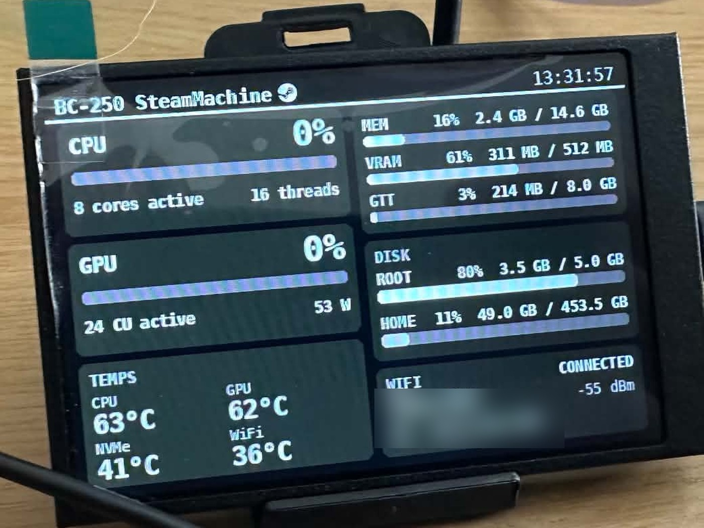
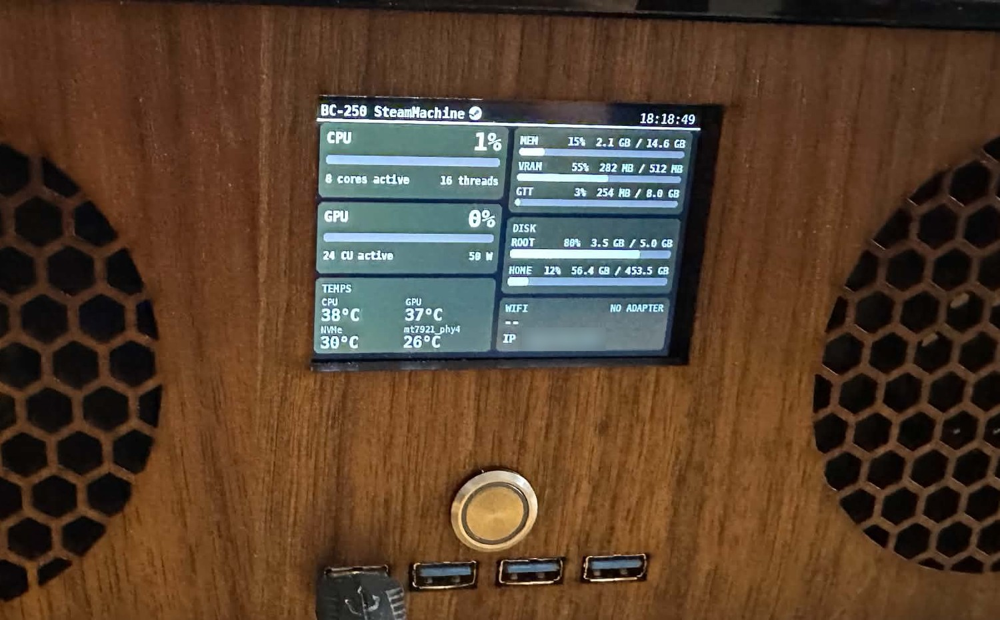

# steam-machine-bc250-screen

Live system stats for an **AMD BC-250 running SteamOS**, rendered on a **Turing Smart Screen 3.5"** in landscape (480 × 320), mounted rotated 180°.

[](LICENSE)
[](https://github.com/yale32/steam-machine-bc250-screen/actions/workflows/ci.yml)


Everything is read from **sysfs / procfs** — no root, no vendor tools, nothing installed system-wide, so it runs happily against SteamOS's read-only root filesystem.

> **Scope.** This is a personal project tuned to one specific pairing: an AMD BC-250 (Cyan Skillfish APU) and a 3.5" RevA Turing screen. The layout, the sensor names and the GPU workarounds are all specific to that combination. It is published in case it is useful — as a working reference for BC-250 sysfs quirks, or as a starting point to adapt. See [Adapting it to other hardware](#adapting-it-to-other-hardware).

---

## What it shows

<p align="center">
  
</p>

<p align="center"><sub>The real panel, photographed. The SSID and IP are blurred; everything else is a live reading.</sub></p>

The same layout in text form:

```
┌ BC-250 SteamMachine (logo) ─────────────── 12:34:56 ┐
│ CPU   12%                │ MEM   19%  2.8 GB / 14.6 GB│
│ ▓▓░░░░░░░░               │ VRAM  56%  289 MB / 512 MB │
│ 8 cores active  16 threads│ GTT    3%  237 MB / 8.0 GB │
├──────────────────────────┼────────────────────────────┤
│ GPU    0%                │ DISK                        │
│ ░░░░░░░░░░               │ ROOT  80%  3.5 GB / 5.0 GB │
│ 24 CU active       59 W  │ HOME  11%  48.8 GB / 453 GB│
├──────────────────────────┼────────────────────────────┤
│ TEMPS                    │ WIFI            CONNECTED  │
│ CPU 66°C     GPU 63°C    │ HomeNet            -58 dBm │
│ NVMe 42°C    WiFi 48°C   │ IP  192.168.1.42            │
└──────────────────────────┴────────────────────────────┘
```

Usage is in **%** and temperatures in **°C**, refreshed every second. The display is **pure monochrome**: every colour is a grey level (R=G=B), white text and bars on dark-grey tiles. With no colour to flag trouble, warnings are inverted: a temperature turns white from 70 °C and becomes a black-on-white badge from 85 °C, and a disk at 90 % full or a dropped WiFi link gets the same badge.

| Stat | Source |
|---|---|
| CPU % | `psutil` |
| Cores / threads active | online CPUs in `/sys/devices/system/cpu` — shows 8 / 16 once the [8-core unlock](#8-core-unlock) is applied, 6 / 12 on stock |
| GPU % | DRM **fdinfo** engine time (see below) |
| CU active | KFD topology: `simd_count / simd_per_cu` (24 on this board) |
| GPU power | amdgpu hwmon `power1_average` (package power, PPT) |
| MEM | `psutil` (used = total − available) |
| VRAM / GTT | `mem_info_vram_*`, `mem_info_gtt_*` in the amdgpu sysfs |
| Temps | **every** hwmon `temp*_input`: CPU (`k10temp`), GPU (`amdgpu`), NVMe, WiFi (`mt7921`), plus any drive with `drivetemp`. Grey < 70 °C, white < 85 °C, badge above |
| Disks | one bar per physical filesystem ≥ 2 GiB (SteamOS bind mounts are de-duplicated, up to 3 shown); the label becomes a badge at 90 % full |
| WiFi | status, SSID and signal from `iw dev <iface> link` (polled every 5 s) |
| IP | this host's IPv4 address on the default route (`wlan0` here), falling back to the first non-loopback address |

### GPU % without `gpu_busy_percent`

On this kernel `/sys/class/drm/card0/device/gpu_busy_percent` returns *Operation not supported*. Utilisation is instead derived from `/proc/<pid>/fdinfo/*` (`drm-engine-gfx` / `drm-engine-compute`, cumulative nanoseconds per client), the same source `nvtop` uses. Only GPU clients this user can read are counted — games and the compositor run as `deck`, but a root-owned GPU process would be invisible.

Verified under load: a headless `vkmark` run reads ≈ 60 % while package power rises from ~60 W to ~69 W.

The amdgpu **clock (sclk) reading is not shown** — it is unreliable on this platform.

---

## Hardware

<p align="center">
  
</p>

<p align="center"><sub>Flush-mounted in the front panel of the case the BC-250 lives in.</sub></p>

| | |
|---|---|
| Screen | Turing Smart Screen 3.5" — USB `1a86:5722`, serial `USB35INCHIPSV2`, **RevA** protocol, 320 × 480 native |
| Connection | `/dev/ttyACM0` (found automatically); `deck` has access through a udev ACL, no root or `uucp` membership needed |
| Host | AMD BC-250, SteamOS, Python 3.13 |

### Screen speed

The link moves roughly **80,000 pixels/s**: a full repaint takes ~1.9 s. So `monitor.py` diffs each frame in 16 × 16 tiles and sends only what changed. A typical update is 1,500–5,000 px and takes 35–100 ms. A full repaint happens at startup and every `FULL_REFRESH_SECS` (default 10 min) to clear any glitch.

---

## Requirements

- An **AMD BC-250** board running **SteamOS** (or any Linux with the amdgpu driver — see [Adapting it to other hardware](#adapting-it-to-other-hardware))
- A **Turing Smart Screen 3.5"** (USB `1a86:5722`, serial `USB35INCHIPSV2`, **RevA** protocol)
- **Python 3.11+** with `venv` available
- `git` (`setup.sh` fetches the driver library with it)
- Read access to the screen's serial device. On SteamOS the `deck` user gets this through a udev ACL, so no root and no `uucp` group membership is needed. On other distributions you may need to add yourself to `dialout`/`uucp`.

## Setup

```bash
./setup.sh
```

Creates `.venv/` (pyserial, Pillow, numpy, psutil) and fetches the [turing-smart-screen-python](https://github.com/mathoudebine/turing-smart-screen-python) driver into `vendor/`, pinned to a known commit. Nothing is installed system-wide, so it works with SteamOS's read-only root. Both folders are git-ignored.

## Run

```bash
.venv/bin/python monitor.py                    # drive the screen; Ctrl-C turns it off cleanly
.venv/bin/python monitor.py --preview out.png  # render one frame to a PNG, no screen needed
.venv/bin/python monitor.py --calibrate        # white-balance test grid (see below)
.venv/bin/python monitor.py --preview-splash s.png  # render the start-up splash to a PNG
```

`--preview` needs no screen, so use it to iterate on the layout.

> Call the venv's `python` directly (as above) rather than relying on the script shebang — that keeps working if the checkout path contains spaces.
>
> **Only one program can use the screen at a time.** If the service below is installed, stop it before running `monitor.py` by hand: `systemctl --user stop bc250-screen`.

### Run at login

```bash
./install-service.sh            # install, enable and start the systemd *user* service
./install-service.sh --remove   # stop, disable and delete it
```

The service (`bc250-screen`) needs no root and lives entirely under `~/.config/systemd/user/`. It starts with the `deck` user session and is restarted after 5 s if it ever exits. Stopping it turns the screen off.

```bash
systemctl --user status bc250-screen      # is it running?
systemctl --user restart bc250-screen     # pick up code or config changes
systemctl --user stop bc250-screen        # stop (screen goes off)
journalctl --user -u bc250-screen -f      # live log
```

Overrides go in `~/.config/bc250-screen.env` as `VAR=value` lines (see [Configuration](#configuration)), then restart the service.

## Making changes

1. Edit `monitor.py` (layout, colours) or `hoststats.py` (data).
2. Check it without the screen: `.venv/bin/python monitor.py --preview /tmp/p.png` and open the PNG.
3. Apply it: `systemctl --user restart bc250-screen`. The screen resets on start, so the first paint takes about 7 s.

Colours are the block at the top of `monitor.py`; panel positions are the `P_*` rectangles beside it.

## Configuration

Environment variables (for the service, put `VAR=value` lines in `~/.config/bc250-screen.env`):

| Variable | Default | Description |
|---|---|---|
| `BRIGHTNESS` | `60` | Backlight, 0–100 |
| `UPDATE_SECS` | `1` | Refresh interval |
| `ORIENTATION` | `reverse_landscape` | `reverse_landscape` (rotated 180°, as mounted here) or `landscape` |
| `DISK_MOUNTS` | *(auto)* | Comma-separated mount points, e.g. `/,/home,/run/media/deck/SD` |
| `COM_PORT` | `AUTO` | Serial device, e.g. `/dev/ttyACM0` |
| `WHITE_BALANCE` | `1,0.82,0.76` | Per-channel gain `R,G,B` applied to each frame before it is sent; `1,1,1` turns it off. See [White balance](#white-balance) |
| `RESET_ON_START` | `auto` | `auto` resets the screen only if the previous run did not stop cleanly; `1` always resets; `0` never. See [Start-up](#start-up) |
| `SPLASH_SECS` | `2.5` | How long the Steam splash stays up before the stats appear |
| `FULL_REFRESH_SECS` | `600` | Interval between full repaints |

---

## Start-up

On every start the screen shows a **Steam logo splash** (logo, "BC-250 SteamMachine", "starting…") for `SPLASH_SECS`, then the stats.

Resetting the screen makes its own firmware play a built-in boot logo for about 5 s, and that image can't be replaced. So the reset is skipped whenever it isn't needed:

- A **clean stop** (`systemctl --user stop/restart`, shutdown, Ctrl-C) finishes the frame in progress, turns the screen off and leaves a marker file, `run/screen-clean`.
- The next start sees the marker, deletes it, and **skips the reset**. The screen is ready in about 1 s and the splash appears straight away.
- If there is no marker (first run, a crash, `kill -9`, power loss) the screen may be out of sync, for instance waiting for the rest of a half-sent image, so it is **reset** once (`RESET_ON_START=auto`).

Stopping is graceful by design: the signal handler only sets a flag and the loop ends after the current frame. Interrupting a frame mid-transfer would leave the screen expecting pixel data, so it would swallow the next commands and stay garbled until reset.

The screen's own power-on logo, shown when USB power first arrives at boot, is firmware and can't be changed from here.

## White balance

The panel's white point is cool, so a perfectly neutral grey looks blue-tinted even though the frame is exactly R=G=B. `monitor.py` compensates by scaling the green and blue channels down just before sending (`WHITE_BALANCE`, default `1,0.82,0.76`). `--preview` shows the uncorrected design, so a preview PNG looks slightly warmer than the screen does.

To re-tune (for example after changing brightness or the screen):

```bash
systemctl --user stop bc250-screen    # if installed as a service: only one program can use the screen
.venv/bin/python monitor.py --calibrate
```

This shows a grid of greys: blue gain across columns 1–5, green gain down rows A–D. Pick the cell that looks neutral (the default is D4: `G0.82 B0.76`), then set `WHITE_BALANCE=1,<G>,<B>` in the environment.

## 8-core unlock

The BC-250 boots with 6 cores (SMU mask `0x77`); this monitor just reports whatever the kernel sees. A **cold boot** resets the unlock to 6 cores, and a **warm reboot** keeps it. Tool: [bc250-core-cu-unlock](https://github.com/GabriWar/bc250-core-cu-unlock).

## Files

```
monitor.py              layout + screen driver (RevA), dirty-tile updates, splash, white balance, --preview, --calibrate
hoststats.py            all sysfs / procfs readers (CPU, GPU, temps, disks, WiFi, IP)
setup.sh                venv + driver library
install-service.sh      systemd user service installer
bc250-screen.service    unit template
requirements.txt        Python dependencies
pyproject.toml          ruff (lint) configuration
assets/steam-logo.png   Steam logo shown in the title bar (Valve trademark; recoloured at runtime)
.github/workflows/ci.yml  lint + a headless --preview render on every push
docs/                   photographs used by this README
```

Created at runtime and git-ignored: `.venv/` (dependencies), `vendor/` (the driver library) and `run/` (the clean-stop marker and the driver's log).

## Troubleshooting

| Symptom | Fix |
|---|---|
| Screen is upside down | `ORIENTATION=landscape` (the default is `reverse_landscape`) |
| Nothing on screen, "Cannot find COM port" | Check `ls /dev/serial/by-id/` shows `Turing_UsbMonitor_USB35INCHIPSV2`; replug the screen (the service retries every 5 s) |
| Screen garbled or frozen after running `monitor.py` by hand | Two programs were writing to it. `systemctl --user stop bc250-screen` first, or restart the service |
| Greys look tinted | Re-run `monitor.py --calibrate` and set `WHITE_BALANCE` (see [White balance](#white-balance)) |
| Turing logo appears when the service starts | The previous run did not stop cleanly, so the screen was reset. It should not recur after a normal stop or restart. Set `RESET_ON_START=0` to never reset (risky after a crash) |
| Screen stays dark after a reboot | `systemctl --user status bc250-screen` and `journalctl --user -u bc250-screen -n 50` |
| GPU % stuck at `--` | No readable GPU clients; check `ls -l /proc/*/fd 2>/dev/null \| grep renderD` |
| `python: No such file` | Run `./setup.sh` first |

---

## Adapting it to other hardware

The project splits cleanly in two, which is the part most likely to be useful to someone else:

- **`hoststats.py`** — every sysfs/procfs reader, with no drawing code. Each reader returns `None` (or an empty list) when the kernel does not expose a value, and the display renders `--` for it. This is where the BC-250-specific workarounds live: fdinfo-based GPU utilisation, KFD compute-unit counting, and the hwmon driver-name map.
- **`monitor.py`** — layout and the RevA screen driver, with no data collection. Colours are the block at the top of the file; panel positions are the `P_*` rectangles beside it.

Common changes:

| Goal | What to change |
|---|---|
| A different Turing screen (RevB / RevC / 5") | Swap the `LcdCommRevA` import and the `display_width`/`display_height` passed to it in `monitor.py`, then adjust `W, H` and the `P_*` rectangles |
| A non-AMD GPU | Replace the GPU readers in `hoststats.py`; the fdinfo approach is vendor-neutral, but VRAM/GTT and power come from amdgpu-specific sysfs paths |
| Different sensor labels | Extend `HWMON_NAMES` in `hoststats.py` — any hwmon driver not listed is shown under its own driver name |
| A different layout | Iterate with `monitor.py --preview out.png`, which needs no screen attached |

`--preview` works on any Linux machine, so you can develop the layout away from the hardware; readings that the host cannot provide simply show as `--`.

## Contributing

Issues and pull requests are welcome — particularly ports to other Turing screen revisions and fixes for BC-250 kernel quirks. See [CONTRIBUTING.md](CONTRIBUTING.md) for how to test a change without the hardware attached.

## License

[GPL-3.0](LICENSE). This project is designed around [turing-smart-screen-python](https://github.com/mathoudebine/turing-smart-screen-python), which is GPL-3.0, and which `setup.sh` fetches into `vendor/` at install time rather than vendoring into this repository.

## Acknowledgements

- [mathoudebine/turing-smart-screen-python](https://github.com/mathoudebine/turing-smart-screen-python) — the screen driver library this project drives the panel with.
- [GabriWar/bc250-core-cu-unlock](https://github.com/GabriWar/bc250-core-cu-unlock) — the 8-core / CU unlock tool referenced above.
- `nvtop`, for demonstrating the DRM fdinfo approach to GPU utilisation that this project reuses.

### Trademarks

`assets/steam-logo.png` is the Steam logo, a trademark of Valve Corporation, used here only to label the device on its own screen. This project is not affiliated with, endorsed by, or sponsored by Valve. "SteamOS" and "Steam Machine" are likewise Valve trademarks, used descriptively to identify the hardware and OS this runs on.
